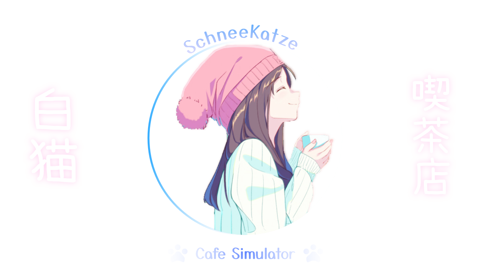

<h1 align="center">Kissaten Simulator</h1>
 
<h2 align="center">Our Basic Algorithm and Programming Course's Final Project</h2>
 

# Ethymologies
## SchneeKatze literally means Snow Cat in German, Whlle Kissaten (our repo's name) means some sort of Cafe in Japanese.

# What is this?
This is a digital object called "Za Programs" which tries to mimic a Cafe 

# What This Program Actually DO?
## Simping a coffee.
Jokes aside, Its simulate a coffee shop with cashier, storage, and also most importantly... "The Membership".

# Functionalities
Tell me more about this program? Fine.

It's Consist of 2 Parts

| Customer Stuff   | Backend Stuff          |
-------------------|-------------------------
| Customer's Order | Inventory Management   |
| Payment          | Membership Management  |
| *Membership      |                        |

[Click Here For More In-depth Stuff Documentation](./docs/modulesBreakdown.md)

(*) yes its also has been implemented

# Implemented Concepts
- Modularity (Obviously)
- Basic File IO
- CRUD

# Contributors
[Fuyuna](https://github.com/nmluci) [Marcel](https://github.com/M-2002) [Spyglare(?)](https://github.com/spyglare) [Diopranata](https://github.com/Diopranata01) [YuliaDewi](https://github.com/nekoochnlia)
